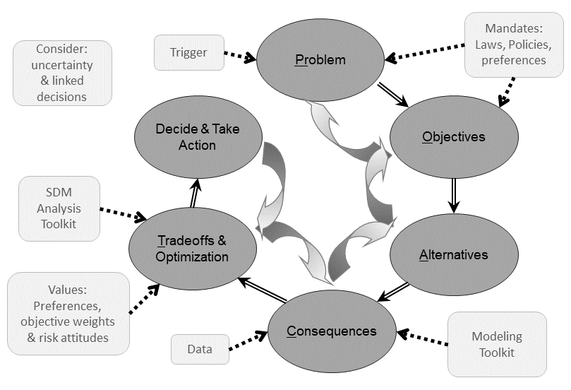

```{r, include=FALSE}
knitr::opts_chunk$set(echo = FALSE,
                      warning = FALSE,
                      tidy = FALSE,
                      message = FALSE,
                      fig.align = 'center',
                      out.width = "100%")
options(knitr.table.format = "html")
##### load libraries #####
library(tidyverse) # upgrade to base R
library(readxl) # read in excel files
library(shiny) # Shiny App
library(shinythemes) # web themes for Shiny
library(DT) # Data Table
library(purrr) # for loop alternative
library(ggmap) # map plotting
library(mapdata) # basemap generation
library(odbc) # database connection 
library(RMySQL) # MySQL scripting in R
library(DBI) # database interface
library(kableExtra) # extra formating of the tables

load("C:/Users/jcummings/OneDrive - UMASS Dartmouth/SMAST/Research/MSE Problem Framing/MSEreview/MSEreview.RData")

study<-study %>% 
  unite(Citation,c(Authors,YearPub),sep=" ",remove=F)

mgmt.join<-mgmt %>% 
  group_by(fkStudyID) %>%
  summarise(ManagementType = toString(sort(unique(ManagementType))),
            AlternativesEvaluated = toString(sort(unique(AlternativesEvaluated))))

obj.join<-obj %>%
  group_by(fkStudyID) %>%
  summarise(ObjectiveCategories = toString(sort(unique(ObjCategory))))

# Join tables
data<-full_join(study,mgmt.join,by=c("ID"="fkStudyID"))
data<-full_join(data,obj.join,by=c("ID"="fkStudyID"))

# Move comment column to the end
data<-data %>%
  select(-'Comments', 'Comments')

# Filter data
data_pub<-filter(data,IncludeInPublication==TRUE)
data_CC<-filter(data,str_detect(Drivers,"Climate Change"))

data_pub.join<-data_pub %>%
  select(ID,Citation)
data_CC.join<-data_CC %>%
  select(ID,Citation)

obj.data_pub<-left_join(data_pub.join,obj,by=c("ID"="fkStudyID"))%>%
  select(-c("ID","ID.y"))
obj.data_CC<-left_join(data_CC.join,obj,by=c("ID"="fkStudyID"))%>%
  select(-c("ID","ID.y"))

alt.data_pub<-left_join(data_pub.join,mgmt,by=c("ID"="fkStudyID"))%>%
  select(-c("ID","ID.y"))
alt.data_CC<-left_join(data_CC.join,mgmt,by=c("ID"="fkStudyID"))%>%
  select(-c("ID","ID.y"))

data_pub<-data_pub %>%
  select(-c("ID"))
data_CC<-data_CC %>%
  select(-c("ID"))

# Get columns whose width needs editing
targets<-match(c("FullCitation","Comments"),names(data))

#####-- Data analysis --#####
# Get columns for study summary
summary.col<-c("Citation",
               "Species",
               "Location",
               "System")
# Get columns for study drivers and problem
prob.col<-c("Citation",
            "ProblemDefinition",
            "Drivers",
            "ConsequencePrediction",
            "TradeOffMethod_Exp",
            "TradeOffMethod_Sub",
            "Decision")
# Get columns for frequency analysis
freq.col<-c("ProcessExplicit",
            "ProblemDefinitionExplicit",
            "ObjectivesExplicit",
            "AlternativesExplicit",
            "TradeOffsExplicit",
            "DecisionExplicit",
            "RolesExplicit",
            "OpenMeetings",
            "ResultsAdopted")
# Get columns for participant analysis
part.col<-c("Leader",
            "Participants",
            "ObjElicitationSource_Exp",
            "ProcedureElicitation_Exp",
            "ObjElicitationSource_Sub",
            "ProcedureElicitation_Sub")
obj.col<-c("ObjType",
           "ObjCategory",
           "ObjDirection",
           "ObjScale")
alt.col<-c("ManagementType",
           "AlternativesEvaluated")
# Get columns for map
map.col<-c("Latitude",
           "Longitude",
           "Citation",
           "Drivers")

# Select data summary columns
summary.data_pub<-data_pub %>%
    select(summary.col)
summary.data_CC<-data_CC %>%
  select(summary.col)

# Frequency of method
n_mse<-nrow(data)
n_pub<-nrow(data_pub)
n_obj_pub<-nrow(obj.data_pub)
n_CC<-nrow(data_CC)
n_obj_CC<-nrow(obj.data_CC)

freq.data_pub<-data_pub %>%
    select(freq.col) %>%
    rename("Process"="ProcessExplicit",
           "Problem"="ProblemDefinitionExplicit",
           "Objectives"="ObjectivesExplicit",
           "Alternatives"="AlternativesExplicit",
           "Tradeoffs"="TradeOffsExplicit",
           "Decision"="DecisionExplicit",
           "Roles"="RolesExplicit",
           "Open Meetings"="OpenMeetings",
           "Adopted"="ResultsAdopted") %>%
    summarise_all(funs(sum))%>%
    gather(Explicit) %>%
    mutate(Percent=value/n_mse*100) %>%
    mutate(Explicit=factor(Explicit,levels=
                  c("Process","Problem","Objectives","Alternatives","Tradeoffs","Decision",
                               "Roles","Open Meetings","Adopted"))) %>%
    rename("Number"="value")

freq.data_CC<-data_CC %>%
  select(freq.col) %>%
  rename("Process"="ProcessExplicit",
         "Problem"="ProblemDefinitionExplicit",
         "Objectives"="ObjectivesExplicit",
         "Alternatives"="AlternativesExplicit",
         "Tradeoffs"="TradeOffsExplicit",
         "Decision"="DecisionExplicit",
         "Roles"="RolesExplicit",
         "Open Meetings"="OpenMeetings",
         "Adopted"="ResultsAdopted") %>%
  summarise_all(funs(sum))%>%
  gather(Explicit) %>%
  mutate(Percent=value/n_mse*100) %>%
  mutate(Explicit=factor(Explicit,levels=
                           c("Process","Problem","Objectives","Alternatives","Tradeoffs","Decision",
                             "Roles","Open Meetings","Adopted"))) %>%
  rename("Number"="value")

# Who participates
part.data_pub<-data_pub %>%
    select(part.col) %>%
    rename("Process"="Leader",
           "Doc Objectives"="ObjElicitationSource_Exp",
           "Doc Alternatives"="ProcedureElicitation_Exp",
           "Sub Objectives"="ObjElicitationSource_Sub",
           "Sub Alternatives"="ProcedureElicitation_Sub")

part.data_pub<- part.data_pub %>%
    purrr::map(~ strsplit(as.character(.),split=",")) %>%
    purrr::map(unlist) %>%
    purrr::map(table)


part.data_pub<-plyr::ldply(part.data_pub,data.frame)
colnames(part.data_pub)<-c("Stage","Participants","Number")

neworder <- c("Process","Participants","Doc Objectives",
              "Sub Objectives","Doc Alternatives",
              "Sub Alternatives")
newlabels <- c("Process","Participants","Explicit Objectives Process",
               "Subjective Objectives Process","Explicit Alternatives Process",
               "Subjective Alternatives Process")

part.data_pub <- part.data_pub %>%
    mutate(Percent=Number/n_pub*100) %>%
    mutate(Stage=factor(Stage,levels=neworder,labels=newlabels)) %>%
    ungroup() %>%
    # 2. Arrange by
    #   i.  facet group =Stage
    #   ii. bar height
    arrange(Stage, Percent) %>%
    # 3. Add order column of row numbers
    mutate(order = row_number())

part.data_CC<-data_CC %>%
  select(part.col) %>%
  rename("Process"="Leader",
         "Doc Objectives"="ObjElicitationSource_Exp",
         "Doc Alternatives"="ProcedureElicitation_Exp",
         "Sub Objectives"="ObjElicitationSource_Sub",
         "Sub Alternatives"="ProcedureElicitation_Sub")

part.data_CC<- part.data_CC %>%
  purrr::map(~ strsplit(as.character(.),split=",")) %>%
  purrr::map(unlist) %>%
  purrr::map(table)


part.data_CC<-plyr::ldply(part.data_CC,data.frame)
colnames(part.data_CC)<-c("Stage","Participants","Number")

part.data_CC <- part.data_CC %>%
  mutate(Percent=Number/n_CC*100) %>%
  mutate(Stage=factor(Stage,levels=neworder,labels=newlabels)) %>%
  ungroup() %>%
  # 2. Arrange by
  #   i.  facet group =Stage
  #   ii. bar height
  arrange(Stage, Percent) %>%
  # 3. Add order column of row numbers
  mutate(order = row_number())

part.dataTable_pub<-part.data_pub %>%
    as_tibble() %>%
    select(Stage,Participants,Number) %>%
    rename("Participant Group"="Participants") %>%
    spread(Stage,Number,fill=0)

part.dataTable_CC<-part.data_CC %>%
  as_tibble() %>%
  select(Stage,Participants,Number) %>%
  rename("Participant Group"="Participants") %>%
  spread(Stage,Number,fill=0)

# What drivers are considered
drive.data_pub<-data_pub %>%
    select(Drivers) %>%
    purrr::map(~ strsplit(as.character(.),split=",")) %>%
    purrr::map(unlist) %>%
    purrr::map(table) %>%
    plyr::ldply(data.frame) %>%
    select(Var1,Freq) %>%
    rename("Driver"="Var1","Frequency"="Freq") %>%
    mutate(Percent=Frequency/n_pub*100) %>%
    arrange(desc(Frequency))

drive.data_CC<-data_CC %>%
  select(Drivers) %>%
  purrr::map(~ strsplit(as.character(.),split=",")) %>%
  purrr::map(unlist) %>%
  purrr::map(table) %>%
  plyr::ldply(data.frame) %>%
  select(Var1,Freq) %>%
  rename("Driver"="Var1","Frequency"="Freq") %>%
  mutate(Percent=Frequency/n_CC*100) %>%
  arrange(desc(Frequency))

# What objectives categories were considered
objcat.data_pub<-data_pub %>%
    select(ObjectiveCategories) %>%
    purrr::map(~ strsplit(as.character(.),split=", ")) %>%
    purrr::map(unlist) %>%
    purrr::map(table) %>%
    plyr::ldply(data.frame) %>%
    select(Var1,Freq) %>%
    rename("Objective Category"="Var1","Frequency"="Freq") %>%
    mutate(Percent=Frequency/n_pub*100) %>%
    arrange(desc(Frequency))

objcat.data_CC<-data_CC %>%
  select(ObjectiveCategories) %>%
  purrr::map(~ strsplit(as.character(.),split=", ")) %>%
  purrr::map(unlist) %>%
  purrr::map(table) %>%
  plyr::ldply(data.frame) %>%
  select(Var1,Freq) %>%
  rename("Objective Category"="Var1","Frequency"="Freq") %>%
  mutate(Percent=Frequency/n_CC*100) %>%
  arrange(desc(Frequency))

# How were objectives defined
obj.data_pub<-obj.data_pub %>%
  select(obj.col) %>%
  purrr::map(table) %>%
  plyr::ldply(data.frame)

obj.data_CC<-obj.data_CC %>%
  select(obj.col) %>%
  purrr::map(table) %>%
  plyr::ldply(data.frame)

colnames(obj.data_pub)<-colnames(obj.data_CC)<-c("Objective","Type","Number")

neworder <- c("ObjCategory","ObjType","ObjDirection","ObjScale")
newlabels <- c("Category","Type","Direction","Scale")

# What Objective types are considered
obj.dataTable_pub <- obj.data_pub %>%
  mutate(Percent=round(Number/n_obj_pub*100,0)) %>%
  mutate('Per MSE'=round(Number/n_pub,2)) %>%
  mutate(Objective=factor(Objective,levels=neworder,labels=newlabels)) %>%
  arrange(Objective,desc(Number))

obj.dataTable_CC <- obj.data_CC %>%
  mutate(Percent=round(Number/n_obj_CC*100,0)) %>%
  mutate('Per MSE'=round(Number/n_CC,2)) %>%
  mutate(Objective=factor(Objective,levels=neworder,labels=newlabels)) %>%
  arrange(Objective,desc(Number))

# What Alternative types are considered
altcat.data_pub<-alt.data_pub %>%
    select(ManagementType) %>%
    purrr::map(~ strsplit(as.character(.),split=",")) %>%
    purrr::map(unlist) %>%
    purrr::map(table) %>%
    plyr::ldply(data.frame) %>%
    select(Var1,Freq) %>%
    rename("Management Type"="Var1","Number"="Freq") %>%
    mutate(Percent=round(Number/n_pub*100,0)) %>%
    mutate('Per MSE'=round(Number/n_pub,2)) %>%
    arrange(desc(Number))

altcat.data_CC<-alt.data_CC %>%
  select(ManagementType) %>%
  purrr::map(~ strsplit(as.character(.),split=", ")) %>%
  purrr::map(unlist) %>%
  purrr::map(table) %>%
  plyr::ldply(data.frame) %>%
  select(Var1,Freq) %>%
  rename("Management Type"="Var1","Number"="Freq") %>%
  mutate(Percent=round(Number/n_CC*100,0)) %>%
  mutate('Per MSE'=round(Number/n_CC,2)) %>%
  arrange(desc(Number))

# Get map background for plotting the map
world <- borders("world", colour="gray50", fill="gray50", alpha=0.75) # create a layer of borders

# Where MSEs have occured
map.data<-rbind(data_pub,data_CC) %>%
  select(map.col) %>%
  mutate(Drivers=str_extract(Drivers, "Climate Change")) %>%
  mutate(Drivers=replace_na(Drivers, "Random Sample"))

# label MSEs articles by analysis for ploting
freq.data_pub<-mutate(freq.data_pub,Analysis="Random Sample")
freq.data_CC<-mutate(freq.data_CC,Analysis="Climate Change")
freq.data<-rbind(freq.data_pub,freq.data_CC)
part.data_pub<-mutate(part.data_pub,Analysis="Random Sample")
part.data_CC<-mutate(part.data_CC,Analysis="Climate Change")
part.data<-rbind(part.data_pub,part.data_CC) %>% 
  arrange(Stage, Percent) %>% 
  mutate(order = row_number())
part.data$order<-c(1,2,3,3,4,4,5,6,7,8,6,9,10,8,9,11,12,10,13,12,13,14,14,15,16,17,18,19,20,
                   16,17,18,20,21,22,23,24,25,21,23,26,25,26,27,27,28,29,30,31,29,32,30,33,
                   32,33,34,35,36,37,38,39,39)
drive.data_pub<-mutate(drive.data_pub,Analysis="Random Sample") %>% 
  mutate(Percent=round(Percent,0)) %>% 
  select(Analysis,Driver,Percent,Frequency)
drive.data_CC<-mutate(drive.data_CC,Analysis="Climate Change")%>% 
  mutate(Percent=round(Percent,0)) %>% 
  select(Analysis,Driver,Percent,Frequency)
drive.data<-rbind(drive.data_pub,drive.data_CC) %>% 
  arrange(Percent) %>%
  mutate(order = row_number())
drive.data$order<-c(6,5,4,3,2,1,8,7,12,9,3,15,14,13,12,11,10,14,16,15,
                   16,6)
# Wrangle objective category data by Random Sample, climate change, and combined
objcat.data_pub<-mutate(objcat.data_pub,Analysis="Random Sample") %>% 
  mutate(Percent=round(Percent,0)) %>% 
  select(Analysis,'Objective Category',Percent,Frequency)
objcat.data_CC<-mutate(objcat.data_CC,Analysis="Climate Change")%>% 
  mutate(Percent=round(Percent,0)) %>% 
  select(Analysis,'Objective Category',Percent,Frequency)
objcat.data<-rbind(objcat.data_pub,objcat.data_CC) %>% 
  rename(OC='Objective Category') %>% 
  arrange(OC) %>% 
  rename('Objective Category'=OC)

# Wrangle objective data by Random Sample, climate change, and combined
obj.dataTable_pub<-mutate(obj.dataTable_pub,Analysis="Random Sample") %>% 
  mutate(Percent=round(Percent,0))
obj.dataTable_CC<-mutate(obj.dataTable_CC,Analysis="Climate Change")%>% 
  mutate(Percent=round(Percent,0))
obj.dataTable<-rbind(obj.dataTable_pub,obj.dataTable_CC) %>% 
  filter(Objective=="Category") %>%
  group_by(Analysis) %>% 
  summarise('AVG'=sum(Number)) %>% 
  mutate(count=c(11,30)) %>% 
  mutate('Per MSE'=round(AVG/count,1)) %>% 
  mutate('Type'=c("Objectives","Objectives"))

altcat.data_pub<-mutate(altcat.data_pub,Analysis="Random Sample") %>% 
  mutate(Percent=round(Percent,0))
altcat.data_CC<-mutate(altcat.data_CC,Analysis="Climate Change")%>% 
  mutate(Percent=round(Percent,0))
altcat.data<-rbind(altcat.data_pub,altcat.data_CC) %>%
  group_by(Analysis) %>% 
  summarise('AVG'=sum(Number)) %>% 
  mutate(count=c(11,30)) %>% 
  mutate('Per MSE'=round(AVG/count,1)) %>% 
  mutate('Type'=c("Alternatives","Alternatives"))

per.MSE<-obj.dataTable %>% 
  mutate(order=c(2,1)) %>% 
  arrange(order) %>% 
  select(Analysis,'Per MSE')

##### Data Analysis Outputs #####
# number of climate change MSE articles
# n_CC

# plot MSEs on map
MSE.map<-ggplot(data=map.data,aes(x=Longitude, y=Latitude,color=Drivers)) + world +
  geom_point(size=2.5) + scale_color_manual(values=c("#66CCCC","#006666")) +  theme_void() +
  theme(legend.position = c(0.15, 0.25))

# plot explicit documentation of steps or components of MSE processes
# Random Sample MSEs
Freq.plot<-ggplot(freq.data,aes(Explicit,Percent,fill=Analysis))+
  geom_col(position="dodge")+geom_vline(xintercept=3.5,linetype="dashed")+
  geom_vline(xintercept=1.5,linetype="dashed")+
  coord_flip()+scale_fill_manual(values=c("#66CCCC","#006666")) +
  scale_y_continuous(limits=c(0,100),expand = c(0,0))+xlab(NULL)+
  scale_x_discrete(
    limits=c("Adopted","Open Meetings","Roles","Decision","Tradeoffs",
             "Alternatives","Objectives","Problem","Process"),
    labels=c("Adopted","Open Meetings","Roles","Decision","Tradeoffs",
             "Alternatives","Objectives","Problem","Process")) +
  guides(fill = guide_legend(reverse=T)) + theme_bw() +
  theme(legend.position = c(0.85,0.07),legend.title = element_blank())

Part.plot<-ggplot(part.data,aes(x=order,y=Percent,fill=Analysis)) +
  facet_wrap(~Stage,scale="free",ncol=2) + geom_col(position="dodge") +
  scale_fill_manual(values=c("#66CCCC","#006666")) +
  scale_x_continuous(breaks = part.data$order,
                     labels = part.data$Participants)+
  scale_y_continuous(limits=c(0,100),expand = c(0,0)) +
  ylab("Percent")+xlab(NULL)+coord_flip() +
  guides(fill = guide_legend(reverse=T)) + theme_bw() +
  theme(legend.position = c(0.86,0.075),legend.title = element_blank())

Driver.plot<-ggplot(drive.data,aes(x=order,y=Percent,fill=Analysis)) +
  geom_col(position="dodge") +
  scale_fill_manual(values=c("#66CCCC","#006666")) +
  scale_x_continuous(breaks = drive.data$order,
                     labels = drive.data$Driver)+
  scale_y_continuous(limits=c(0,100),expand = c(0,0))+
  ylab("Percent")+xlab(NULL)+coord_flip() +
  guides(fill = guide_legend(reverse=T)) + theme_bw() +
  theme(legend.position = c(0.825,0.075),legend.title = element_blank())
```

###
Fisheries management has mostly focused on fishing impacts with ecosystem status viewed as a background constant.
  
The increasing rate of climate change is changing this dynamic, bringing ecosystem status to the forefront of fisheries management.

Management strategy evaluation (MSE) is "widely considered to be the most appropriate way to evaluate the trade‐offs achieved by alternative management strategies and to assess the consequences of uncertainty for achieving management goals” [@R-Punt]. Thus, MSE is a compelling tool to assess climate change impacts and test climate-ready options for fisheries management decisions.

Adaptive management arose to address uncertainties and accelerate progress towards meeting management objectives. We used the structured decision making (SDM) process [@R-SDM] -- the decision making framework in which adaptive management occurs -- as our framework, how do published MSE projects utilize standard SDM components and support learning within the MSE practitioner community?  

<center>


```{r, include=FALSE}
knitr::write_bib(c('posterdown', 'rmarkdown','pagedown'), 'packages.bib')
```

### Objectives
We review published MSEs against the steps of the SDM framework to:  

* Determine the rate of documentation, and use of steps, in the MSE process:  
* Identify participants in MSE processes.
* Highlight unique aspects of MSEs that model climate change as a driver.
* Identify aspects of successful MSEs that can be adopted to inform fisheries management in a changing climate  
* Provide insights about MSE processes and documentation that can further learning to improve future MSEs

### MSE Literature Review Methods
We conducted our search for MSEs in the SCI-EXPANDED index from Web of Science, searching for “management strategy evaluation” by topic across all years on January 8th, 2019. This search returned 253 results.  We reviewed a random sample of 30 articles that document a MSE, removing articles that were reviews, meta-analyses, or simply cited other MSE articles from our sample. Of the 253 articles, 11 included climate change as a driver of fishery status, and after removing other articles we estimate 110-160 articles document a MSE.   

| MSE type | Count |
|:--:|:--:|
| Published (estimated) | 110-160 |
| Random Sample | 30 |
| Climate Change | 11 |  
<br>
<br>

### Where have climate change MSEs occurred?
To date MSEs modeling climate change have been concentrated in North America and Australia (Figure \@ref(fig:mapfigure)).

```{r, mapfigure, fig.cap='Map of MSE study locations.', fig.height=4, out.width="100%"}
MSE.map +
  theme(text = element_text(size=14))
```

### Are structured decision making steps explicit in MSEs?
The majority of MSEs did not explicitly document how the stages of the MSE process -- defined using the SDM framework -- were completed (Figure \@ref(fig:explicit)).

```{r explicit, fig.cap='Percentage of MSEs that included explicit documentation (colored bars) of SDM process steps --- Roles and meetings --- and adoption of results. In the remaining MSEs documentation was inexplicit, or absent, and whether the results were adopted was unknown.', fig.height=5.5, out.width="100%"}
text1<-expression(paste("Inexplicit \nor Absent"))
text2<-paste("Absent")
text3<-paste("Unknown")
Freq.plot + annotate("text", x = 8.75, y = 50, label = 'underline("Else")', size=20, parse=TRUE) +
  annotate("text", x = 5, y = 52, label = text1, size=20) + 
  annotate("text", x = 2.6, y = 50, label = text2, size=20) + 
  annotate("text", x = 1, y = 50, label = text3, size=12) +
  theme(text = element_text(size=14))
```

### Who is involved in MSEs?
The primary participants and leaders of the MSE processes were scientists, with some lead by governments and management agencies (Figure \@ref(fig:participants)).  Objectives and alternatives were elicited from a variety of participants, with scientists seemingly selecting these components in cases where documentation was inexplicit.

```{r participants, fig.cap='Who guided, participated in, or provided input during the specified steps of the MSE process', fig.height=6, out.width="100%"}
Part.plot +
  theme(text = element_text(size=14))
```

### What questions and management objectives do MSEs address?
Uncertainty in system parameters was the main driver of the system state, but a variety of drivers were considered across the random sample of MSEs (Figure \@ref(fig:driversPlot)).

```{r driversPlot, fig.cap='Drivers included in MSE models', fig.height=6, out.width="100%"}
Driver.plot +
  theme(text = element_text(size=14))
```

More objectives were considered per MSE in the random sample than in the climate change MSEs (Table \@ref(tab:PerMSE)).  Climate change MSEs were less likely to consider economic and social objectives than the random sample (Table \@ref(tab:objectiveCategories)).

```{r, PerMSE}
color_Pub <- which(per.MSE$Analysis=='Random Sample')
color_CC <- which(per.MSE$Analysis=='Climate Change')

per.MSE %>%
  kable(align = "c", caption = "Number of objectives considered per management strategy evaluation") %>%  
  row_spec(color_CC, color = "#66CCCC", background = "white") %>%
  row_spec(color_Pub, color = "#006666", background = "white")
```

```{r, objectiveCategories}
color_Pub <- which(objcat.data$Analysis=='Random Sample')
color_CC <- which(objcat.data$Analysis=='Climate Change')

objcat.data %>%
  kable(align = "c", caption = "Objective categories considered in management strategy evaluations") %>%
  row_spec(color_CC, color = "#66CCCC", background = "white") %>%
  row_spec(color_Pub, color = "#006666", background = "white")
```

### Main Conclusions
The picture painted by MSE documentation is one of scientist driven simulation studies rather than management driven decision processes. 
While documentation about the **modeling** conducted in a MSE was explicit, documentation about the **process used to make decisions** about the MSE model **were limited**. Scientists participated in, or seemingly directly selected the objectives and alternatives to evaluate in most MSEs. Facilitators and decision analysts -- participants focused on the decision making process -- were rarely participants in MSE processes.  Conservation, Economic, and Yield focused objectives were commonly considered, while **broader social objectives were rarely considered**.

Despite numerous applications of MSE, the applications that include climate change are limited, leaving uncertainty about the best approach to MSE use for fishereis management that accounts for a changing environment.

### Explore our review on the web!
Check out our shiny app (<https://jonathancummings.shinyapps.io/MSEreview/>).

### References